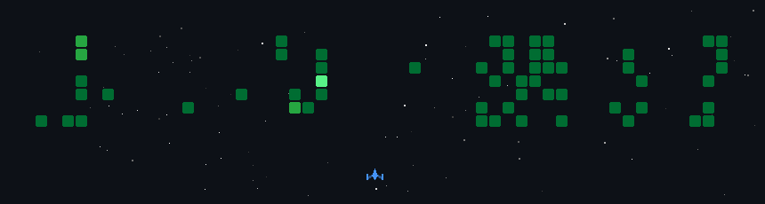

# Hey there, I'm Shivam 👋
### 🎓 BE Student (AI & ML) · JNNCE Shivamogga · 2nd Year

<p align="center">
  
</p>

---

## 🧑‍💻 About Me

> *"Backend was scary for me at first — now it's my playground."*

I'm a **second-year AI & ML engineering student** who fell in love with building things on the server side. I started with the basics and now I'm deep into building **REST APIs**, authentication systems, and backend architectures using **Node.js, Express, and MongoDB**.

I'm not just learning to code — I'm learning to **build real systems** that solve real problems.

- 🔭 Currently building: **Collge Event  management system, Auth Systems, Backend Projects**
- 🌱 Actively learning: **Node.js · Express.js · MongoDB · REST API Design**
- 🤖 Exploring: **AI/ML concepts, LLMs, Automation Tools**
- 🎯 End goal: **Full-Stack Engineer with deep AI expertise**
- ⚡ Fun fact: *I started with fear, now I'm coding with confidence*

---

## 🛠️ Tech Stack & Skills

### ⚙️ Backend


### 🗄️ Database


### 🤖 AI & ML


### 🧰 Tools & Environment


---

## 🚀 What I'm Building

```
🔗 Collge Event  management system     → Node.js + Express + MongoDB + JWT Auth
🔐 Auth System           → Register · Login · Protected Routes · JWT
📡 REST APIs             → MVC Architecture · Mongoose · bcrypt
🤖 AI Experiments        → Exploring LLMs, Automation & AI Tools
```

---

## 📌 My Backend Journey

```
JavaScript Basics  ──►  Node.js & Express  ──►  MongoDB & Mongoose
                                                        │
                                              REST APIs & Auth Systems
                                                        │
                                            Full-Stack + AI Engineer 🎯
```

---

## 🎮 GitHub Activity Game

<p align="center">
  
</p>

---

## 📊 GitHub Stats

<p align="center">
  
</p>

<p align="center">
  
</p>

<p align="center">
  
</p>

---

## 🤝 Let's Connect

<p align="left">
  <a href="https://www.linkedin.com/in/shivam076/" target="_blank">
    
  </a>
  <a href="mailto:p622133@gmail.com">
    
  </a>
  <a href="https://github.com/DEV1767" target="_blank">
    
  </a>
</p>

---

<p align="center">
  
</p>

<p align="center">
  <i>⭐ Open to collaborations, backend projects, and AI experiments!</i>
</p>
